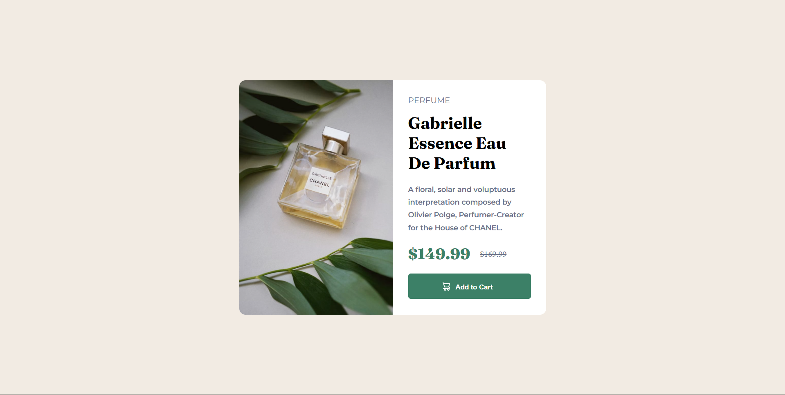

# Frontend Mentor - Product preview card component solution

This is a solution to the [Product preview card component challenge on Frontend Mentor](https://www.frontendmentor.io/challenges/product-preview-card-component-GO7UmttRfa). Frontend Mentor challenges help you improve your coding skills by building realistic projects. 

## Table of contents

  - [Overview](#overview)
  - [The challenge](#the-challenge)
  - [Screenshot](#screenshot)
  - [Links](#links)
  - [My process](#my-process)
  - [Built with](#built-with)
  - [What I learned](#what-i-learned)
  - [Continued development](#continued-development)
  - [Author](#author)

## Overview

### The challenge

Users should be able to:

- View the optimal layout depending on their device's screen size
- See hover and focus states for interactive elements

### Screenshot

### Links

- Live Site URL: (https://charles7458.github.io/product-preview-solution)

## My process
    I built the desktop
### Built with

- Semantic HTML5 markup
- CSS custom properties
- JavaScript

### What I learned

I learnt to use Javascript to do actions according to different media screens.
I learnt how to use sass. I used sass to write the css.

### Continued development

I coded faster this time. Javascript is tough and easily gets messy, so have to work on it.

## Author

- Frontend Mentor - [@Charles7458](https://www.frontendmentor.io/profile/Charles7458)

